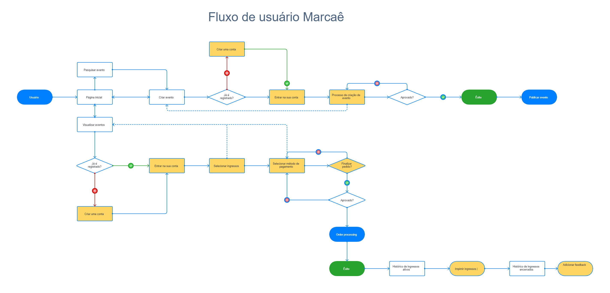
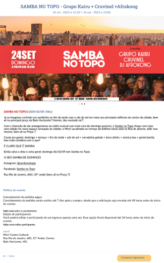
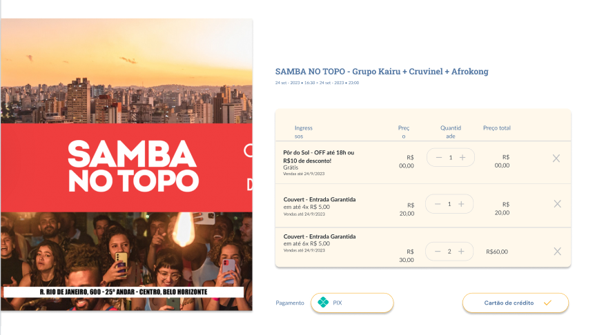
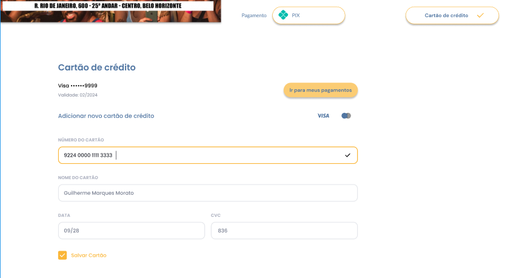
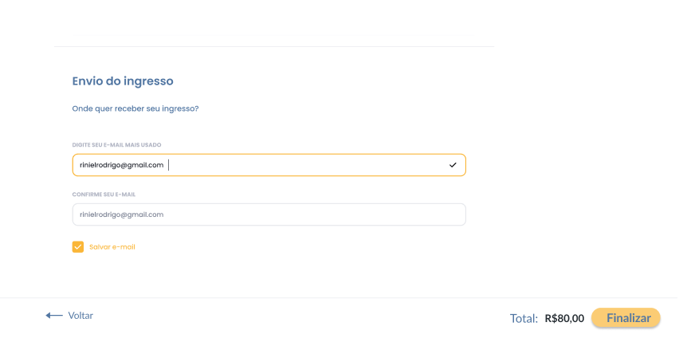

# Projeto de Interface

## User Flow

O diagrama exibido na Figura 1 mostra o fluxo principal onde ilustra a sequência de interações do usuário ao longo das etapas do sistema. Cada uma das fases desse processo será detalhada na seção subsequente, intitulada "Protótipo de Média Fidelidade". Para visualizar o protótipo, acesse o <a href="https://www.figma.com/file/q9EqSVGC7zONyYejZ9xUqa/Site-do-Projeto-Eixo-1---PUC-Minas?type=design&node-id=0%3A1&mode=design&t=6IYslppfxkUeoECs-1">ambiente Figma do projeto</a>.

<figure>
    <figcaption>Figura 1 - Fluxo principal de usuário
</figure>

## Protótipo de média fidelidade

<h3><b>Tela - Home page</b></h3>

A tela da página inicial apresenta muitas informações, tais como os eventos em destaque, os eventos mais procurados, o atalho para filtrar o evento de seu gosto, ou até mesmo a cidade, login, cadastre-se, torne-se um produtor para promoção de eventos, a interação do público com o produtor e o feedback do público após o evento. 

  

<figure> 
  <figcaption>Figura 2 - Tela home page
</figure> 

<h3><b>Tela - Login</b></h3>

A tela de login permite entrar com sua conta criada diretamente no site, preenchendo e-mail e senha, ou dando a opção de entrar usando suas redes sociais, sendo ela Google ou Facebook.

  

<figure> 
  <figcaption> Figura 3 - Tela de Login
</figure> 

<h3><b>Tela - Registre-se.</b></h3>

A tela de registre-se permite você criar sua conta a partir de suas informações, como: seu primeiro nome, segundo nome, e-mail e sua senha, ou dando opção de criar sua conta com suas redes sociais, sendo ela Google ou Facebook.

  

<figure> 
  <figcaption> Figura 4 - Tela de Registre-se
</figure> 

<h3><b>Tela - Visualização de eventos</b></h3>

A tela de visualização de evento oferece aos usuários uma visão das informações essenciais sobre um evento. No topo da tela, destaca-se o título do evento, seguido de uma breve descrição que fornece uma prévia do que os participantes podem esperar. Logo abaixo, estão listados alguns detalhes, como data, horário e local, garantindo que os usuários tenham acesso rápido a essas e outras informações cruciais.

<figure> 
  <figcaption> Figura # - Tela de visualização de evento
</figure> 

<h3><b>Tela - Compra de ingressos</b></h3>

A página de compra de ingressos proporciona aos utilizadores uma experiência intuitiva para garantir a sua participação no evento desejado. Nesta página, os detalhes do evento, como título, data, hora e local, são apresentados de forma clara para reforçar a escolha do usuário.
Logo abaixo, é disponibilizada uma seleção de tipos de ingressos, cada um com a sua respetiva categoria e preço. Os usuários podem selecionar a quantidade desejada e, se aplicável, escolher preferências adicionais. O processo de pagamento é simplificado com opções seguras e populares disponíveis.

<figure> 
  <figcaption> Figura # - Tela de compra de ingressos
</figure> 

<h3><b>Tela - Eventos Ativos</b></h3>

A tela de eventos ativos consiste em mostrar os eventos cujo ingresso foi comprado pelo usuário e que ainda não aconteceram, tendo a opção de visualizar o ingresso comprado e imprimir o mesmo.

<figure> 
  <figcaption> Figura # - Tela de Eventos ativos
</figure> 

<h3><b>Tela - Eventos Encerrados</b></h3>

A tela de eventos encerrados consiste em verificar os eventos encerrados, ou até mesmo em expor sua opinião pessoal referente ao evento comparecido, apenas clicando no botão de interação "Adicionar Feedback".

<figure> 
  <figcaption> Figura # - Tela de Eventos encerrados.
</figure> 

<h3><b>Tela - Adicionar Feedback</b></h3>

A tela de adicionar feedback consiste em expor sua opinião pessoal referente ao evento comparecido, com a disponibilidade de você escrever sua opinião, enviar alguma mídia, seja em fotos ou vídeos, marcar com estrelas seu nível de satisfação sobre tal evento ou as chances de recomendar para um amigo.

  

<figure> 
  <figcaption> Figura # - Tela de Adicionar Feedback.
</figure> 

