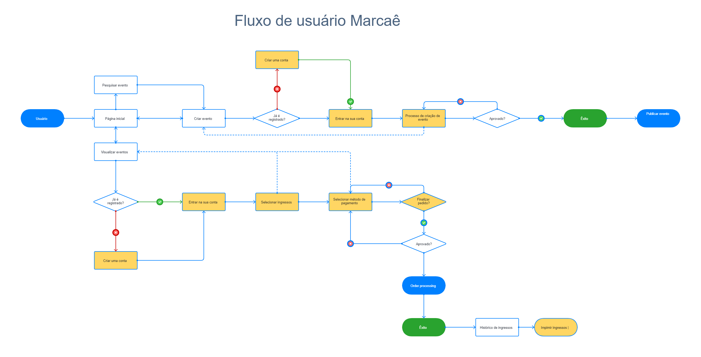

# Projeto de Interface

## User Flow

O diagrama exibido na Figura 1 mostra o fluxo principal onde ilustra a sequência de interações do usuário ao longo das etapas do sistema. Cada uma das fases desse processo será detalhada na seção subsequente, intitulada "Protótipo de Média Fidelidade". Para visualizar o protótipo, acesse o <a href="https://www.figma.com/file/q9EqSVGC7zONyYejZ9xUqa/Site-do-Projeto-Eixo-1---PUC-Minas?type=design&node-id=0%3A1&mode=design&t=6IYslppfxkUeoECs-1">ambiente Figma do projeto</a>.

<figure>
    <figcaption>Figura 1 - User Flow
</figure> 

## Protótipo

Desenvolver um protótipo emerge como uma das maneiras mais ágeis e econômicas de validar uma ideia, conceito ou funcionalidade. Isso permite a interação, avaliação, modificação e aprovação das principais características de uma interface antes de entrar na fase de desenvolvimento. Leia o artigo [Protótipos: baixa, média ou alta fidelidade?](https://medium.com/ladies-that-ux-br/prot%C3%B3tipos-baixa-m%C3%A9dia-ou-alta-fidelidade-71d897559135).

### Protótipo de baixa fidelidade

Protótipos de baixa fidelidade apresentam de forma simplificada o design da interface e o relacionamento entre suas páginas, permitindo evolução da proposta da solução. Neste projeto, os utilizaremos para apoiar a validação dos requisitos e efetuar mudanças dos mesmos, caso seja necessário, para menor impacto na codificação da aplicação.

[Elabore as principais interfaces gráficas da aplicação de modo que os requisitos funcionais sejam contemplados nas telas propostas.]

[Adicione aqui as telas da sua aplicação com seus devidos títulos.] 
 
> **Links Úteis**:
> - [Protótipos vs Wireframes](https://www.nngroup.com/videos/prototypes-vs-wireframes-ux-projects/)
>- Ferramentas:
>> - [Pencil](https://pencil.evolus.vn/)
>> - [MarvelApp](https://marvelapp.com/)
>> - [Figma](https://www.figma.com/)

